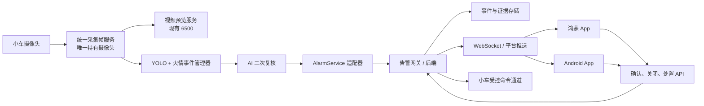

# 火情识别与小车、手机 App 对接说明

> 适用版本：2026-07-12 当前工程实现
> 目的：约定火情检测、小车端、告警服务端、鸿蒙 App、Android App 的接入边界和联调协议。
> 注意：本文明确区分“已经实现”和“后续需要实现”的内容。

---

## 1. 当前火情链路

### 1.1 已实现行为

火情模块在 `fire_smoke_detection/`，当前工作流程：

1. YOLO 实时检测摄像头或本地视频中的 `fire`、`smoke`。
2. 只有置信度 **>= 0.70** 的 `fire` / `smoke` 才参与触发；低于阈值不抓拍、不调用 AI。
3. 在 **2 秒**窗口中累计 **5 次**有效命中后，创建火情事件并抓拍。
4. AI 接收的是**未画框的原始 JPEG**；视频读取和 YOLO 推理不等待 AI 返回。
5. 单次 AI 请求超时 **30 秒**；失败时立即用**同一张照片**重试，最多额外重试 **2 次**，总共最多 3 次。
6. AI 结果：
   - `confirmed_fire`：确认明火，触发火灾报警；
   - `suspected_smoke`：疑似火灾烟雾，触发烟雾报警；
   - `no_fire`：不报警；若持续检测，30 秒后才再次复审；
   - 三次 AI 请求都失败：触发 `ai_unavailable`，提示人工介入。
7. 正式证据图保存到 `fire_smoke_detection/runtime/evidence/`，最多保留 10 张；每张图有对应 JSON 元数据。
8. 当前告警服务为本地 `LoggingAlarmService`：写入 `runtime/alarms.jsonl` 和 `runtime/fire_monitor.log`。
9. 测试窗口的“停止”会终止检测进程树，避免遗留的 YOLO 子进程继续占用摄像头。

### 1.2 当前尚未实现

下列内容是本文规定的后续对接任务，目前没有网络上报或 App 页面实现：

- 小车向后端上传火灾、烟雾、AI 服务失效事件；
- 后端存储事件和证据图片，向手机实时推送；
- 鸿蒙与 Android 的报警列表、详情、确认处置；
- 手机下发停止巡航、开始录像、返航等受控命令；
- 设备认证、离线队列、网络重传和审计。

---

## 2. 总体架构



---

## 3. 摄像头与小车端集成（必须遵守）

### 3.1 一个物理摄像头只能由一个采集端持有

正式部署时，不能让视频服务和检测器同时直接打开同一个摄像头，例如：

```text
小车视频服务 -> cv2.VideoCapture(0)
火情检测器   -> detector.py --source 0
```

这种模式会造成摄像头竞争、打开失败、画面卡顿或停止后仍然被占用。

**正确方案：** 小车端设置“统一采集服务”作为唯一摄像头持有者，然后把同一帧分发给视频预览与火情检测。

推荐优先级：

1. **推荐：同一 Python 进程共享帧。** 在 `app.py` / `camera_rosmaster.py` 中只读取一次摄像头。视频生成器和火情检测线程读取同一个最新帧缓存。
2. **可选：视频流订阅。** 统一采集服务提供 RTSP 或 MJPEG，检测器订阅该流而不是再打开 `0`；上线前必须测试推理延迟和流稳定性。
3. **禁止用于正式运行：多个进程直接 `VideoCapture(0)`。** 仅可用于临时桌面测试。

### 3.2 现有小车能力

| 项目 | 当前能力 | 默认值 / 位置 |
|---|---|---|
| 控制通道 | TCP 小车控制协议 | 默认 `6000`，鸿蒙 App 可配置 |
| 控车帧格式 | `$...#` 文本帧 | `oh-ai-car-ros-app/doc/ros_api.md` |
| 视频服务 | 小车 Flask / Web 服务 | 默认 `6500` |
| 视频接口 | MJPEG `/video_feed` | 根目录 `app.py`、`rosmaster_no_control.py` |
| 手机视频页面 | WebView | `http://<小车IP>:<视频端口>/index2` |

### 3.3 端口与职责分离

**不要把火情报警 JSON 发送到现有 6000 控车端口。** 原 TCP 通道是 `$...#` 控车协议，且服务端实现为 `listen(1)`，不适合作为多手机报警订阅通道。

| 通道 | 用途 | 约束 |
|---|---|---|
| `6000/TCP` | 原有小车控制 | 只传现有 `$...#` 控制帧 |
| `6500/HTTP` | 小车 Web 页面 / 视频 | 保持现有视频功能 |
| `HTTPS` | 小车上报告警、手机查事件 | 新增告警网关接口 |
| `WSS` / 平台推送 | 手机实时收到报警 | 新增服务端能力 |
| 小车命令服务 | 网关到小车的受控处置 | 独立鉴权与审计，不能裸露给 App |

---

## 4. 报警数据模型

### 4.1 报警类型

| `alarm_type` | 触发条件 | 手机文案 | 推荐级别 |
|---|---|---|---|
| `confirmed_fire` | AI 确认明火 | 确认明火 | `critical` |
| `suspected_smoke` | AI 确认疑似火灾烟雾 | 疑似火灾烟雾 | `warning` |
| `ai_unavailable` | AI 三次请求均失败 | AI 服务失效，需人工介入 | `warning` |

### 4.2 当前代码已有的 `AlarmEvent`

```json
{
  "event_id": "fire_20260712_112235_397294_001",
  "alarm_type": "confirmed_fire",
  "occurred_at": "2026-07-12T11:22:41.123456+08:00",
  "reason": "AI 判断画面存在明火",
  "confidence": 0.98,
  "evidence_path": ".../runtime/evidence/fire_....jpg",
  "local_detection_gone": false
}
```

说明：

- `event_id`：小车本次火情事件唯一编号；
- `evidence_path`：仅是小车本地路径，**手机不能使用**；
- `local_detection_gone`：AI 返回时，本地 YOLO 命中是否已消失。只要 AI 已确认，报警仍应保留。

### 4.3 统一网络事件模型

小车与手机跨网络使用以下 JSON；后端将本地图片转换为 `evidence_url`：

```json
{
  "schema_version": 1,
  "event_id": "fire_20260712_112235_397294_001",
  "device_id": "rosmaster-01",
  "alarm_type": "confirmed_fire",
  "severity": "critical",
  "occurred_at": "2026-07-12T11:22:41.123456+08:00",
  "reason": "AI 判断画面存在明火",
  "ai": {
    "state": "completed",
    "result": "confirmed_fire",
    "confidence": 0.98,
    "attempts": 1
  },
  "local_detection": {
    "classes": ["fire"],
    "max_confidence": 0.86,
    "trigger_window_seconds": 2,
    "trigger_min_hits": 5,
    "local_detection_gone": false
  },
  "evidence": {
    "available": true,
    "content_type": "image/jpeg",
    "evidence_url": null,
    "sha256": "<上传后由服务端记录>"
  },
  "status": "open"
}
```

---

## 5. 告警网关接口契约（待实现）

> 后端可以使用 FastAPI、Spring Boot、Node.js 等任意技术栈；鸿蒙和 Android 必须使用同一套协议。

### 5.1 认证要求

小车到网关使用 HTTPS，并配置每台小车自己的 `device_id` 和设备令牌：

```http
Authorization: Bearer <device-access-token>
X-Device-Id: rosmaster-01
X-Request-Id: <UUID>
```

课堂局域网调试也应校验设备令牌。真实 AI Key、设备令牌、推送密钥不得进入 Git、App 包、日志或截图。

### 5.2 小车上报告警

```http
POST /api/v1/fire-events
Content-Type: multipart/form-data
```

字段：

| 字段 | 类型 | 必填 | 说明 |
|---|---|---:|---|
| `event` | JSON 字符串 | 是 | 第 4.3 节事件对象 |
| `evidence` | JPEG 文件 | 否 | 初始抓拍原图；AI 失效无图时可省略 |

成功响应：

```json
{
  "event_id": "fire_20260712_112235_397294_001",
  "accepted": true,
  "duplicate": false,
  "status": "open",
  "evidence_url": "https://<gateway>/api/v1/fire-events/fire_20260712_112235_397294_001/evidence"
}
```

#### 幂等与重试

- 后端用 `(device_id, event_id, alarm_type)` 做幂等键；
- 同一事件重传时不能重复创建记录或重复推送；
- 小车网络失败时写入本地离线队列，使用 1、2、4、8 秒等指数退避，最大间隔 60 秒；
- 上报失败不能阻塞摄像头、YOLO 和 AI 线程；
- 后端成功确认后才删除离线队列项。

### 5.3 手机报警列表

```http
GET /api/v1/fire-events?device_id=rosmaster-01&status=open&limit=20
```

响应：

```json
{
  "items": [
    {
      "event_id": "fire_20260712_112235_397294_001",
      "device_id": "rosmaster-01",
      "alarm_type": "confirmed_fire",
      "severity": "critical",
      "occurred_at": "2026-07-12T11:22:41.123456+08:00",
      "reason": "AI 判断画面存在明火",
      "confidence": 0.98,
      "status": "open",
      "evidence_url": "https://<gateway>/api/v1/fire-events/.../evidence"
    }
  ],
  "next_cursor": null
}
```

### 5.4 报警详情和证据

```http
GET /api/v1/fire-events/{event_id}
GET /api/v1/fire-events/{event_id}/evidence
```

手机只能通过受保护的 HTTPS 地址下载图片，不能访问或显示小车上的 `evidence_path`。

### 5.5 人工确认与关闭

```http
POST /api/v1/fire-events/{event_id}/acknowledgements
```

```json
{
  "action": "acknowledge",
  "operator_id": "student-01",
  "operator_name": "值班人员",
  "note": "已查看现场视频，正在核查"
}
```

`action`：`acknowledge`（确认收到）、`resolve`（已处理）、`false_alarm`（人工确认误报）、`escalate`（升级）。后端必须保存操作人、时间、动作和备注，不可直接删除报警。

### 5.6 实时通知

```text
wss://<gateway>/api/v1/notifications
```

服务端推送：

```json
{
  "type": "fire_event.created",
  "occurred_at": "2026-07-12T11:22:41.123456+08:00",
  "data": {
    "event_id": "fire_20260712_112235_397294_001",
    "device_id": "rosmaster-01",
    "alarm_type": "confirmed_fire",
    "severity": "critical",
    "reason": "AI 判断画面存在明火"
  }
}
```

App 回到前台、WebSocket 重连或收到推送后，仍要调用列表接口同步服务端状态，不能只依赖推送。

---

## 6. 小车端改造建议

### 6.1 新增 HTTP 告警适配器

当前 `fire_monitor/alarm_service.py` 中已有以下抽象：

```python
class AlarmService(Protocol):
    def report_confirmed_fire(self, event: AlarmEvent) -> bool: ...
    def report_suspected_smoke(self, event: AlarmEvent) -> bool: ...
    def report_ai_unavailable(self, event: AlarmEvent) -> bool: ...
```

建议新增 `HttpAlarmService`，并与现有 `LoggingAlarmService` 组合：

- `LoggingAlarmService` 继续承担本地审计和离线兜底；
- `HttpAlarmService` 负责上传 JSON 和 JPEG；
- 任何一个服务失败都不应阻塞实时检测；
- 上报失败应进入本地待发送队列；
- 使用事件幂等键防止重复报警。

### 6.2 小车环境配置建议

在小车 `.env` 或受保护系统配置中增加；只提交 `.env.example`，不要提交真实 token：

```dotenv
FIRE_DEVICE_ID=rosmaster-01
FIRE_ALARM_BASE_URL=https://<gateway>
FIRE_ALARM_TOKEN=<device-access-token>
FIRE_ALARM_CONNECT_TIMEOUT_SECONDS=5
FIRE_ALARM_REQUEST_TIMEOUT_SECONDS=15
FIRE_ALARM_QUEUE_DIR=runtime/alarm_queue
```

AI 配置与报警网关配置必须分离。AI Key 仅在小车端保存，手机和后端日志不能出现该 Key。

### 6.3 小车异常处理

| 场景 | 小车端动作 | 手机端期望 |
|---|---|---|
| YOLO 未达 0.70 | 不累计、不抓拍 | 无通知 |
| AI `no_fire` | 不报警；持续命中 30 秒后再复审 | 无报警 |
| AI 确认明火/烟雾 | 本地记录并立即网络上报 | 高优先级通知和列表项 |
| AI 三次失败 | 本地记录并上报 `ai_unavailable` | 显示人工介入提醒 |
| 网关不可达 | 离线队列 + 后台重试 | 恢复后同步一次事件 |
| 摄像头失败 | 统一采集端重连并上报设备健康 | 显示视频/设备异常 |

---

## 7. 小车处置命令（第二阶段）

报警后的“停止巡航、开始录像、打开直播、返航”必须是独立的、受审计的命令，不与报警消息混用。

```http
POST /api/v1/devices/{device_id}/commands
```

```json
{
  "command_id": "<UUID>",
  "command": "stop_patrol",
  "requested_by": "student-01",
  "requested_at": "2026-07-12T11:30:00+08:00"
}
```

| 命令 | 说明 | 约束 |
|---|---|---|
| `stop_patrol` | 停止自动巡航 | 可以立即执行，必须回执 |
| `start_recording` | 开始录像 | 不能影响火情检测 |
| `stop_recording` | 停止人工录像 | 不删除已有证据 |
| `open_live_view` | 获取直播授权 | 返回临时视频地址/令牌 |
| `return_home` | 返航 | 仅在安全导航能力完成后开放 |

已有小车协议中 `cmd 64` 是中止巡航，`cmd 61` / `cmd 62` 是开始/结束录像。后续由**小车可信端的命令适配层**映射高层命令到 `$...#` 控车协议；App 不能直接拼接和发送底层控制帧。

---

## 8. 鸿蒙 App 对接

### 8.1 现有工程

鸿蒙工程在 `oh-ai-car-ros-app/`：

- 网络配置：`entry/src/main/ets/pages/NetworkSettings.ets`
- TCP 控车：`entry/src/main/ets/tcp/`
- 视频 WebView：`entry/src/main/ets/components/VideoComponents.ets`
- 小车协议：`doc/ros_api.md`

保留现有“小车 IP / 控制端口 / 视频端口”配置，同时新增独立的“告警服务地址”和 App 用户登录信息。告警服务地址不能强行复用小车 IP 或 TCP 6000 端口。

### 8.2 建议页面

1. **报警中心**：按 `confirmed_fire > suspected_smoke > ai_unavailable` 排序，显示设备、时间、原因、状态。
2. **报警详情**：显示证据图、AI 结论、AI 置信度、YOLO 触发信息、直播入口和处置按钮。
3. **设备状态（可选）**：显示设备在线、最后心跳、摄像头状态、AI 状态、离线待同步数量。

### 8.3 鸿蒙端流程

```text
App 启动/回到前台
  -> 用户登录，获得 App token
  -> GET 未关闭报警
  -> 建立 WebSocket
  -> 新事件：本地通知 + 刷新列表
  -> 点详情：GET 报警详情
  -> 确认/关闭：POST acknowledgement
  -> 小车处置：POST command
```

鸿蒙应用需按使用的 HarmonyOS SDK 配置网络权限。断网时可缓存已拉取列表，但恢复后必须以服务端结果为准。

---

## 9. Android App 对接

Android 与鸿蒙**必须共用完全相同**的 REST、WebSocket 和 JSON 模型。

建议模块：

```text
app/
  data/AlarmApi              # REST
  data/AlarmWebSocket        # 实时订阅
  data/AlarmRepository       # 网络与缓存统一入口
  model/FireEvent
  model/AlarmAcknowledgement
  model/DeviceCommand
  ui/AlarmListScreen
  ui/AlarmDetailScreen
  notification/AlarmNotificationManager
```

Android 端要求：

- `confirmed_fire` 显示高优先级通知，通知点击直达详情；
- 支持报警列表刷新、WebSocket 重连、网络切换；
- 图片只读取 `evidence_url`，不解析本地 `evidence_path`；
- 用户确认/关闭操作等待服务端成功响应后再更新 UI；
- App 重启后从后端恢复全部未关闭报警；
- WebSocket 适合前台实时更新；后台、被系统回收或连接中断时，还需接入 Android 平台推送。推送中只放 `event_id`、设备和简短文案，打开 App 后再拉取详情。

---

## 10. 服务端存储与安全

建议的表/集合：

| 名称 | 用途 | 关键字段 |
|---|---|---|
| `devices` | 小车注册 | 设备 ID、名称、密钥版本、在线状态 |
| `fire_events` | 报警事件 | 设备、事件 ID、类型、时间、AI/YOLO 信息、状态 |
| `event_evidence` | 证据元数据 | 事件 ID、对象存储键、哈希、内容类型、访问策略 |
| `acknowledgements` | 人工处置审计 | 事件、操作者、动作、备注、时间 |
| `device_commands` | 小车命令审计 | 命令 ID、请求者、状态、回执、时间 |

证据安全：

- `runtime/evidence/` 是小车本地目录，不直接暴露给公网；
- 服务端保存图片 SHA-256，并通过登录令牌或短时签名 URL 提供访问；
- 图片可能包含人员或现场隐私，禁止上传到公开读对象存储；
- 小车继续最多保留 10 张，服务端长期归档策略按课程和隐私要求决定；
- 不提交 `.env`、AI API Key、设备 token、推送密钥；
- 不让 App 直接接入底层小车 TCP 控制端口。

---

## 11. 联调顺序与验收

### 阶段 A：小车本地检测

- [x] YOLO 置信度阈值 0.70；
- [x] 2 秒/5 次命中抓拍；
- [x] 未画框原图异步 AI 复审；
- [x] 30 秒超时、同图最多两次重试；
- [x] 本地证据最多 10 张；
- [x] AI 成功/失败本地日志与 JSONL 审计；
- [x] 停止窗口释放检测进程树；
- [ ] 正式小车改为统一摄像头采集和分帧。

### 阶段 B：告警网关

- [ ] 实现 `POST /api/v1/fire-events`；
- [ ] 验证设备令牌和 `device_id`；
- [ ] 保存 JPEG，返回受保护 `evidence_url`；
- [ ] 幂等去重和小车离线队列重传；
- [ ] WebSocket / 平台推送；
- [ ] 报警确认、关闭和审计。

### 阶段 C：鸿蒙与 Android

- [ ] 共同使用本文事件模型和接口；
- [ ] 实现报警列表、详情、证据图、确认/关闭；
- [ ] 前台 WebSocket，后台推送；
- [ ] 断网恢复、重复推送、图片失败均有清晰状态；
- [ ] 三种报警类型使用不同颜色和文案。

### 端到端验收用例

1. **确认明火**：YOLO 达阈值 -> AI `confirmed_fire` -> 小车上报 -> 两端 App 高优先级通知 -> 可看图并确认。
2. **手机屏幕里的火焰**：YOLO 可触发，但 AI `no_fire` -> 手机不报警。
3. **疑似烟雾**：AI `suspected_smoke` -> 两端显示橙色预警。
4. **AI 不可用**：连续三次失败 -> `ai_unavailable` -> App 显示“需人工介入”。
5. **网关断网**：小车本地报警、写离线队列；恢复后后端仅出现一条事件。
6. **App 断线恢复**：重新拉取未关闭事件，状态与服务端一致。
7. **摄像头资源**：视频预览与检测并行时，只有统一采集模块打开物理摄像头；停止后可被其他程序重新打开。

---

## 12. 代码定位

| 文件 | 作用 |
|---|---|
| `fire_smoke_detection/fire_monitor/event_manager.py` | 命中累计、抓拍、AI 结果状态机、触发报警 |
| `fire_smoke_detection/fire_monitor/ai_reviewer.py` | AI 请求、超时、重试 |
| `fire_smoke_detection/fire_monitor/alarm_service.py` | 当前本地告警服务；后续 HTTP 适配器放置点 |
| `fire_smoke_detection/fire_monitor/types.py` | `AlarmEvent`、AI 结果和状态枚举 |
| `fire_smoke_detection/runtime/alarms.jsonl` | 当前本地报警审计（运行时文件，不提交 Git） |
| `fire_smoke_detection/fire_monitor_test_window.py` | 真实摄像头/本地视频测试窗口和进程树停止 |
| `app.py`、`camera_rosmaster.py` | 小车 Web 视频与摄像头相关代码 |
| `rosmaster_no_control.py` | TCP 6000 和视频 6500 的参考实现 |
| `oh-ai-car-ros-app/doc/ros_api.md` | 已有小车 TCP 控制协议 |
| `oh-ai-car-ros-app/.../NetworkSettings.ets` | 鸿蒙网络配置 |
| `oh-ai-car-ros-app/.../VideoComponents.ets` | 鸿蒙视频预览入口 |

---

## 13. 实施结论

现有火情模块已经具备本地检测、抓拍、AI 二次复审、失败重试、证据限额与本地报警记录能力。后续实施优先级应为：

1. 统一小车摄像头采集，避免双进程抢占摄像头；
2. 实现 `HttpAlarmService` 和告警网关的幂等上报；
3. 鸿蒙和 Android 复用同一 REST / WebSocket 协议完成报警中心；
4. 最后接入经过授权和审计的小车处置命令、后台推送。

这样可以形成从小车发现火情、AI 确认、手机通知、人工处置到审计追溯的完整闭环。
