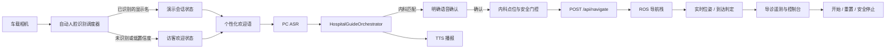
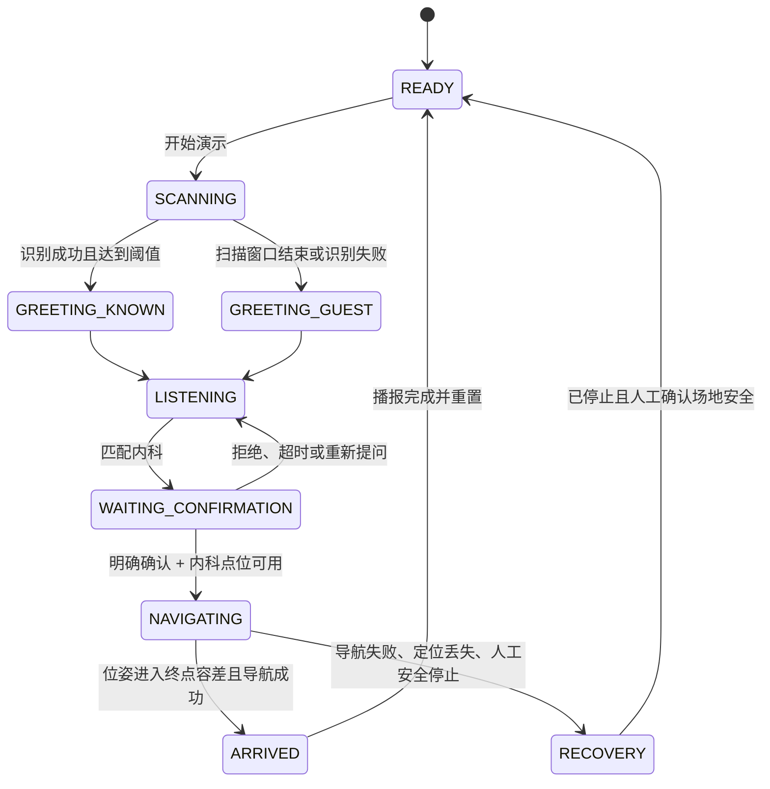

# 五分钟医院导诊小车演示：端到端集成设计

## 状态

**提议中，等待评审。**

本文将现有的人脸识别、医院导诊语音和 ROS 导航组合为一次可重复的五分钟实体车演示。它补充而不替代：

- `docs/superpowers/specs/2026-07-16-hospital-guide-voice-design.md`
- `docs/superpowers/specs/2026-07-16-real-time-hospital-guide-bridge-design.md`
- `docs/superpowers/specs/2026-07-16-live-patrol-pose-design.md`

## 目标

在固定场地展示一次完整、可解释且可恢复的服务流程：

1. 车载摄像头自动识别已注册用户；
2. 小车以识别出的姓名进行欢迎；
3. 用户通过语音提出导诊需求；
4. 导诊模块匹配到内科并请求确认；
5. 用户明确确认后，小车从固定起点实际导航至预先保存的内科地图坐标；
6. 小车在终点容差内播报到达，并在控制台留下可查看的事件记录。

演示总时长上限为 5 分钟。主路线唯一目标为 **内科**，不在本次演示中切换楼层或更换目标科室。

## 已确认的产品决定

| 事项 | 决定 | 影响 |
| --- | --- | --- |
| 人脸能力的职责 | 身份欢迎和个性化导诊入口 | 人脸成功结果必须安全地传给导诊会话，但不传递密码、邮箱、手机号或人脸图像。 |
| 人脸触发方式 | 自动识别 | 从车载相机获取帧，避免要求演示员点击现有 `/face` 页面。 |
| 导诊主路线 | 内科 | 只启用 `internal_medicine` 一个演示目标；其他科室保留禁用。 |
| 行驶形式 | 实体车实走 | 必须在清场后的固定起点和固定路线验证。 |
| 终点形式 | 固定地图坐标 | 答辩前通过已有地图控制台采集 `x`、`y`、`theta`，保存至内科配置。 |
| 导航门控 | 明确语音确认 | 人脸成功、科室匹配或急诊提示本身都不得直接发出导航目标。 |
| 识别失败 | 访客导诊 | 无法识别、低置信度或人脸服务失败时，使用通用欢迎语继续导诊，不阻断流程。 |
| 自动识别后的交互 | 暂定为立即欢迎并提问 | 成功后播报“你好，{姓名}。请问您需要去哪个科室？”，并开始监听；评审时可调整。 |

## 现状与缺口

### 已可复用的能力

- `face/routes.py` 提供 `POST /api/face/recognize`，返回 `identity`、`confidence`、用户标识及候选项；成功后当前仅异步播报“你好，{姓名}”。
- `hospital_guide_bridge.py` 已将最终 ASR 文本交给 `HospitalGuideOrchestrator`，并通过 `HospitalGuideNavigationClient` 调用既有 `POST /api/navigate`。
- `voice_assistant/data/hospital_guide_template.json` 已有内科条目和别名。
- `navigation/routes.py` 已提供地图信息、地图坐标换算、初始位姿、单点导航、导航栈状态及实时位姿的 API。
- `hospital_guide_console.py` 和 `HospitalGuideTelemetry` 能呈现导诊会话及已请求的导航状态。
- `scripts/start_hospital_guide_demo.py` 和 `.sh` 已能启动真实 PC ASR、Jetson 车端客户端及导诊控制台。

### 本次必须补齐的能力

1. 自动人脸识别调度器：从车载相机定时取帧、去重、阈值判定和冷却。
2. 演示会话状态：保存最小身份上下文、状态转换、超时和显式复位；不得保存人脸原图、凭据或病历。
3. 人脸到导诊的接口：仅把显示名和一次会话标识安全传入欢迎语；不能让人脸路由直接驱动底盘。
4. 内科点位启用：写入验证后的 `x`、`y`、`theta`，并使内科导航启用；配置变更必须可审阅。
5. 导航过程可观测性：将“目标已受理、运动中、到达、失败、被人工中止”显示在导诊遥测/演示控制台中。
6. 演示控制与恢复：提供可见的开始、重置和安全停止操作；安全停止必须以底盘/导航栈的实际停止能力为准，不能只停止网页动画或语音。

## 端到端架构

## 状态机与不变量

- `NAVIGATING` 只能由 `WAITING_CONFIRMATION` 转入；人脸识别、LLM 标记或急诊提示均不能跳过确认。
- 内科导航配置必须同时满足：`enabled=true`、有限数值坐标、导航栈健康、有效 map 坐标系定位、场地安全检查通过。
- 同一会话内，同一张脸在冷却窗口内不得重复触发欢迎或重复写入导诊状态。
- 在导航期间，自动识别不改变当前用户或目标科室；只有人工重置后才允许下一轮识别。
- “到达”同时要求导航执行成功与机器人在地图位姿中进入终点容差；仅收到目标不算到达。
- 任何异常均禁止伪造“已到达内科”播报。

## 五分钟演示脚本和证据

| 时间 | 对外动作 | 系统证据 | 失败时的诚实回退 |
| --- | --- | --- | --- |
| 00:00–00:20 | 清场、放到起点，点击开始演示 | 控制台显示导航栈健康、地图名、起点定位和内科点位已校验 | 不健康则停止演示并显示未满足项。 |
| 00:20–00:50 | 用户进入摄像头视野 | 自动识别状态、置信度和会话 ID | 识别超时/失败后进入访客欢迎。 |
| 00:50–01:15 | 小车欢迎并询问科室 | 遥测 `identity_recognized` 或 `guest_fallback` | 使用通用问候，不暴露候选人、置信度或错误细节。 |
| 01:15–02:00 | 用户说“我想去内科” | ASR 最终文本，状态 `WAITING_CONFIRMATION`，待确认科室 `internal_medicine` | ASR/导诊失败时提示重复一次或控制台复位。 |
| 02:00–02:20 | 小车询问是否带路，用户确认 | `navigation_requested` 与目标坐标校验结果 | 未确认则继续导诊，不发送导航。 |
| 02:20–04:20 | 小车实际行驶至内科坐标 | 导航栈状态、实时位姿、到达容差判定 | 安全停止，播报“导航暂不可用，请联系工作人员”，控制台标明原因。 |
| 04:20–04:40 | 播报到达 | `arrived` 事件、最终位姿和持续时间 | 不满足到达条件时不得播报完成。 |
| 04:40–05:00 | 展示遥测并重置 | 状态回到 `READY`，身份和待确认科室已清空 | 重置失败则停止下一轮自动识别并提示人工处理。 |

## 现场配置与安全基线

### 内科坐标采集和锁定

1. 启动当前导航栈并确认地图名称与答辩场地相同。
2. 将车放到约定起点，通过已有地图页面设置初始位姿，确认 `/api/nav/pose` 返回 `valid=true` 且 `frame_id='map'`。
3. 在空场地把内科终点选定为不遮挡人员通道的位置，使用现有地图工具记录 `x`、`y`、`theta`。
4. 由两名成员复核坐标与实际可达性后，将数值写入 `internal_medicine.navigation`；仅该条目设置 `enabled=true`。
5. 在无观众时从正式起点连续试跑三次；三次均到达且没有人工接管，才允许用于答辩。

### 安全停止和异常回退

- 演示前必须明确一位唯一安全操作员，负责观察路线、使用已验证的底盘/导航急停方式、并在停车后决定继续或重置。
- 现有导诊设计已指出：停止语音或普通网页运动命令不等价于取消已下发的导航目标。本次不得宣传未被实车验证的“语音急停导航”。
- 控制台的“安全停止”只有接到实车验证过的导航取消/底盘停止路径后才可用；否则只能显示操作说明和不可用原因。
- 导航失败、定位无效、人员进入路线或安全操作员介入时，终止本轮并播报保守提示；只能在车完全停止后重置。

## 验收标准

### 自动化

- 覆盖人脸成功、未识别、低置信度、相机失败和冷却期重复帧。
- 身份上下文只含显示名与会话 ID；重置或超时后无法从 API/遥测读取先前身份。
- 导诊仅在精确确认且内科点位启用时调用一次导航客户端。
- 自动识别、低置信度、急诊表达、拒绝确认和 LLM 输出均不能直接调用导航。
- 导航失败、定位无效、人工安全停止时不会生成 `arrived` 事件或到达播报。
- 现有医院导诊、导航位姿、控制台和人脸相关测试保持通过。

### 实车

- 答辩地图、起点与内科坐标已记录，并在答辩当天复核。
- 从正式起点连续三次完整试跑，均完成“识别/访客回退 → 内科确认 → 行驶 → 位姿到达 → 到达播报”。
- 每轮结束后均能恢复 `READY`，不遗留待确认科室、用户显示名或导航任务。
- 安全操作员可在任何运行状态下让小车实际停止；该操作已经在清场测试中验证。
- 任一关键故障发生时，小车保持或转为停止状态，并以非误导性提示结束本轮。

## 不在范围内

- 医疗诊断、处方、病历、挂号、支付、长期用户画像或真实患者身份认证。
- 多人排队识别、跨摄像头追踪、后台持续录制、云端保存人脸图片。
- 自动多科室路径切换、跨楼层电梯调度、动态避障策略重写或未验证的语音取消导航。
- 伪造导航到达、替换真实 ASR/导航响应或掩盖错误。

## 风险与缓解

| 风险 | 影响 | 缓解措施 |
| --- | --- | --- |
| 光线、角度或网络使人脸识别失败 | 无法个性化欢迎 | 预注册、预检相机与服务；自动降级为访客导诊。 |
| 重复识别同一人 | 重复播报、打断导诊 | 会话锁、冷却窗口、导航期间禁用识别。 |
| 地图漂移或初始位姿错误 | 小车偏离路线 | 每次开始前检查 map 位姿；固定起点；三次试跑。 |
| 内科坐标不可达 | 导航超时或失败 | 选择无障碍物的终点，测试后锁定坐标；失败时安全停止。 |
| ASR 环境噪声 | 不能匹配或确认 | 使用短固定台词、近距离讲话、控制台显示最终文本。 |
| 未验证的停止通路 | 人身和设备风险 | 不将其描述为可用；只有实车验证后才开放控制台操作。 |
| 无意泄漏身份信息 | 隐私风险 | 仅在当前内存会话保留显示名，不把原始帧、手机号、邮箱或密码写入遥测。 |

## 评审请求

请确认本文作为实现前的设计基线，特别是下列暂定决策：

- 自动识别成功后立即欢迎并开始导诊；
- 识别失败在扫描窗口结束后进入访客导诊；
- 内科为唯一启用的导航目标；
- 只有经过实车验证的停止路径才向演示员开放；
- 以三次连续现场试跑作为实体车演示放行条件。

确认后，下一步将输出带精确文件路径、接口契约、测试先行步骤和现场验证命令的实施计划；在该计划获得确认前不改动运行功能代码。
