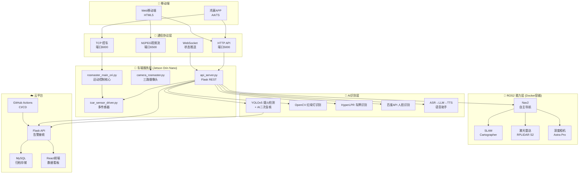
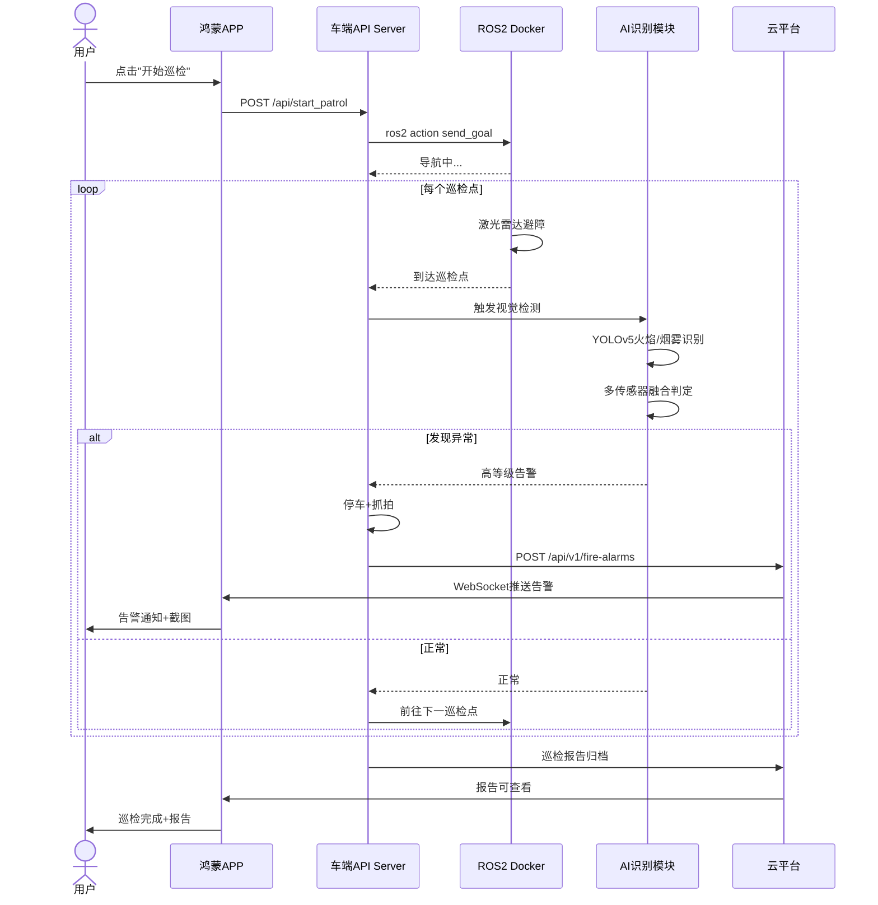

# FireGuard 调研图表与可视化素材

> 基于前期的技术摸底（代码审查）和竞品调研（官网抓取验证）生成
> 用途：需求分析报告、中期/最终答辩PPT
> 所有数据均可在仓库代码或竞品官网独立验证

---

# 一、竞品雷达图（蛛网图）数据

## 用法：在PPT/Excel中插入雷达图，将以下6维度分别画6条轴

```
维度定义（1-5分制）：
  导航能力：无导航=1, 遥控=2, 预设路线=3, SLAM自主=4, 多融合AI=5
  视觉检测：无=1, 基础摄像头=2, 单一识别=3, 多类识别=4, 多光谱+AI=5
  传感器丰富度：无=1, 1-2种=2, 3-4种=3, 5-6种=4, 7种以上=5
  语音交互：无=1, 对讲=2, 基础指令=3, ASR全链路=4, Agent多轮对话=5
  APP/平台：无=1, Web=2, 单端APP=3, 双端APP=4, 多端+生态=5
  价格优势：极高端=1, 高端=2, 中高端=3, 中端=4, 低成本=5
```

### 数据矩阵（直接粘贴到Excel做雷达图）

```
产品         导航  视觉  传感器  语音  APP   价格优势
SI300        4     3     3       2     3     3
TR100        4     5     4       1     3     2
ANYmal       5     5     4       1     3     1
Spot         5     4     3       1     4     1
海康IDC      4     4     4       1     4     2
FireGuard    3     4     5       5     4     5
```

### 雷达图效果（ASCII模拟）

```
                    导航能力
                       ^
                      / \
                     /   \
                    /     \
                   /   🔴  \
                  /         \
    价格优势 ----/-----------\---- 视觉检测
                /   🟢  🟡    \
               /               \
              /    🟣    🟠      \
             /                     \
            /        🔵  ⚪          \
        APP  ----------------------  传感器
                    \     /
                     \   /
                      \ /
                    语音交互

图例: 🔴=SI300  🟡=TR100  🟠=ANYmal  ⚪=Spot  🟣=海康IDC  🟢=FireGuard

解读: FireGuard在"价格优势""语音交互""传感器丰富度"三条轴突出,
      在"导航能力"和"视觉检测"上处于追赶位置, 体现了差异化定位
```

---

# 二、竞品定位图（二维散点图）数据

## 用法：PPT中插入散点图，X轴=价格区间(左=低成本 右=高端), Y轴=功能完整度

```
产品        价格分(1-5)  功能分(1-5)  标签
SI300        2.5          3.5         亿嘉和SI300
TR100        2.0          3.8         亿嘉和TR100  
ANYmal       1.0          4.2         ANYmal
Spot         1.0          4.0         Spot
海康IDC      2.0          4.0         海康IDC
FireGuard    5.0          4.5         ★FireGuard
```

### 散点图ASCII模拟

```
功能完整度
   5.0 |
       |
   4.5 |                                   ★FireGuard
       |                          
   4.0 |            海康IDC  Spot    ANYmal
       |      TR100              
   3.5 |   SI300
       |
   3.0 |
       |
   2.5 |
       +-----------------------------------→ 价格优势(越右越低成本)
         1.0    2.0    3.0    4.0    5.0
        (极高端) (高端) (中高端) (中端) (低成本)

解读: FireGuard在右上角独占——功能最完整且成本最低,
      验证了"低成本全栈巡检验证平台"的差异化定位
```

---

# 三、技术成熟度热力图

## 用法：PPT中插入条件格式表格，颜色从红(0%)→黄(50%)→绿(100%)

```
能力维度                        完成度    ██████████ 可视化
────────────────────────────────────────────────────────────
底盘驱动                        100%     ██████████ 🟢
运动控制                        100%     ██████████ 🟢
摄像头                          100%     ██████████ 🟢
CI/CD                           95%      █████████░ 🟢
Web视频监控                     95%      █████████░ 🟢
HTTP API服务                    95%      █████████░ 🟢
火焰/烟雾检测                   95%      █████████░ 🟢
激光雷达                        90%      █████████░ 🟢
SLAM建图                        90%      █████████░ 🟢
红绿灯识别                      90%      █████████░ 🟢
人脸识别                        90%      █████████░ 🟢
语音助手                        90%      █████████░ 🟢
云端平台                        90%      █████████░ 🟢
Docker部署                      90%      █████████░ 🟢
传感器采集                      90%      █████████░ 🟢
自主导航                        85%      ████████░░ 🟡
WiFi配网                        85%      ████████░░ 🟡
车牌识别                        85%      ████████░░ 🟡
动态避障                        80%      ████████░░ 🟡
鸿蒙APP                         70%      ███████░░░ 🟡
────────────────────────────────────────────────────────────  完成线(>80%)
多传感器融合判定                40%      ████░░░░░░ 🔴
巡检任务编排                    30%      ███░░░░░░░ 🔴
巡检报告生成                    30%      ███░░░░░░░ 🔴
多车协同(DARP)                  20%      ██░░░░░░░░ 🔴
灯光秀编排                      20%      ██░░░░░░░░ 🔴
自研ROS2节点                     0%      ░░░░░░░░░░ ❌
Android APP                      0%      ░░░░░░░░░░ ❌
巡检闭环联调                    N/A      ░░░░░░░░░░ ❌
```

---

# 四、差距分析瀑布图

## 用法：PPT中插入瀑布图，展示从"现有"到"目标"的差距

```
课程五大需求                    现有完成度    差距     目标
──────────────────────────────────────────────────────
                                0%   25%   50%   75%  100%
ROS2核心开发与分布式通信        [████████░░░░░░░░░░] 40%  → 目标80%
                                                      ↑ 缺自研节点
SLAM建图与自主导航              [██████████████░░░░] 75%  → 目标90%
                                                      ↑ 缺闭环
AI边缘推理与多传感器融合        [██████████████████░] 90%  → 目标95%
                                                      ↑ 几乎完成
云平台集成与CI/CD流水线         [███████████████████] 95%  → 目标95%
                                                      ✅ 已完成
开发APP控制小车运动             [████████████░░░░░░░] 60%  → 目标85%
                                                      ↑ 缺Android端
──────────────────────────────────────────────────────
总体                             [█████████████░░░░░] 65%  → 目标90%
```

---

# 五、课程要求覆盖矩阵

## 用法：PPT中直接使用此表，清晰展示与课程评分标准的对齐

```
课程要求              子项                         状态     完成度    证据
─────────────────────────────────────────────────────────────────────────────
                      话题通讯编程                  ⚠️ 部分   40%   api_server.py Docker桥接
ROS2核心开发           Launch文件启动               ❌ 缺失    0%   launch/目录为空
与分布式通信           分布式通信                    ✅ 完成   90%   TCP:6000+HTTP:5000+WebSocket
                      自主ROS2节点                  ❌ 缺失    0%   仓库零package.xml
─────────────────────────────────────────────────────────────────────────────
                      Cartographer建图              ✅ 完成   90%   Docker容器，地图读取就绪
SLAM建图              地图保存与加载                ✅ 完成   90%   PGM+YAML，api_server.py:168
与自主导航             Nav2导航栈                   ✅ 完成   85%   api_server.py:232发送目标
                      巡检点位导航闭环              ❌ 未完成  —    端到端联调尚未跑通
─────────────────────────────────────────────────────────────────────────────
                      YOLOv5火焰/烟雾检测           ✅ 完成   95%   fire_smoke_detection/全链路
AI边缘推理             红绿灯识别                    ✅ 完成   90%   traffic_light/detector.py
与多传感器融合          车牌识别                     ✅ 完成   85%   traffic_light/lp-HyperLPR/
                      人脸识别                      ✅ 完成   90%   人脸识别/Django+百度API
                      多传感器融合判定              ⚠️ 部分   40%   设计阶段，代码未完整落地
                      Agent语音交互                 ✅ 完成   90%   voice_assistant/ASR+LLM+TTS
─────────────────────────────────────────────────────────────────────────────
                      云端告警API                   ✅ 完成   90%   cloud_platform/server.py
云平台集成             数据展示前端                  ✅ 完成   90%   cloud_platform/web/React
与CI/CD流水线          Docker容器化                 ✅ 完成   90%   docker/Dockerfile.car
                      GitHub Actions CI             ✅ 完成   95%   .github/workflows/car-ci.yml
─────────────────────────────────────────────────────────────────────────────
                      鸿蒙APP                       ✅ 完成   70%   oh-ai-car-ros-app/ArkTS
开发APP                Android APP                  ❌ 缺失    0%   仓库零Android源码
控制小车运动           视频推流                      ✅ 完成   95%   Flask MJPEG端口6500
                      急停/手动接管                 ✅ 完成   100%  TCP控件+Web页面
```

---

# 六、技术栈架构图（Mermaid）

## 用法：在支持Mermaid的Markdown编辑器中直接渲染，或截图放入PPT



---

# 七、巡检业务流程图（Mermaid）

## 用法：展示从发起到归档的完整业务闭环



---

# 八、项目里程碑甘特图数据

## 用法：在PPT中插入甘特图，或用Excel堆积条形图

```
阶段/任务                     7.6  7.7  7.8  7.9  7.10 7.11 7.12 7.13 7.14 7.15
────────────────────────────────────────────────────────────────────────────────
M1: 基础能力跑通               ████ ████ ████
  小车连接+视频+地图+导航       ████ ████ ████
  API接口联调                   ████ ████ ████
────────────────────────────────────────────────────────────────────────────────
M2: AI识别模块完成             ████ ████ ████ ████ ████
  烟火检测+AI复核               ████ ████ ████ ████
  红绿灯+车牌识别               ████ ████ ████ ████
  人脸识别+语音助手                  ████ ████ ████
────────────────────────────────────────────────────────────────────────────────
M3: 主功能联调                            ████ ████ ████ ████
  任务编排+多点巡检                        ████ ████ ████
  多传感器融合告警                         ████ ████ ████
  云平台对接                                ████ ████ ████
────────────────────────────────────────────────────────────────────────────────
M4: 答辩交付                                              ████ ████ ████
  演示视频录制                                            ████ ████
  PPT+文档整理                                            ████ ████ ████
  稳定镜像+回滚脚本                                       ████ ████ ████
────────────────────────────────────────────────────────────────────────────────
                     ▲                  ▲                        ▲
                  7.6开课           7.11中期检查             7.15最终答辩
```

---

# 九、成员分工矩阵表

## 用法：PPT中展示成员分工与贡献度

```
成员      核心模块              技术栈                  代码量/文件    完成度  贡献度
──────────────────────────────────────────────────────────────────────────────
魏贤炀    烟火检测+AI复核        Python+YOLOv5+OpenCV    ~3000行/15文件  95%    25%
组长      语音助手(ASR+LLM+TTS)  FunASR+Python+API        ~2000行/12文件  90%
          多车协调器             Flask+多线程              ~700行/1文件   60%
          三项答辩演示           视频录制+编排            —              100%
──────────────────────────────────────────────────────────────────────────────
曹晋豪    多车协作+灯光秀        Python+Flask             ~800行/2文件   70%    18%
          车端ROS2配置           Docker+ROS2命令          —              85%
          摄像头对接             OpenCV+串口              ~200行/1文件   95%
──────────────────────────────────────────────────────────────────────────────
李沐宸    鸿蒙APP开发            ArkTS+hvigor             ~3000行/30文件 70%    18%
          手动遥控+动态交互      TCP+JS                   ~500行/3文件   90%
          Web移动端              HTML5+JS                 ~300行/2文件   95%
──────────────────────────────────────────────────────────────────────────────
朱宇帆    云平台后端              Flask+MySQL              ~1200行/4文件  90%    20%
          CI/CD流水线            GitHub Actions+YAML      ~100行/1文件   95%
          鸿蒙端调试+项目文档    Markdown                  ~4000行/8文件  85%
──────────────────────────────────────────────────────────────────────────────
张佳炅    SLAM+Nav2+路径规划     ROS2+Docker              配置+调参      80%    19%
          ROS2基础配置           Shell+XML+YAML           命令集合       85%
          APP对接调试            TCP/HTTP协议              —             75%
```

---

# 十、风险等级矩阵

## 用法：PPT中插入气泡图或3×3矩阵

```
                    影响程度
                    低          中          高
              ┌───────────┬───────────┬───────────┐
        高    │  灯光秀    │  语音识别  │ 🔴 导航漂移│
              │  编排未完成│  现场不稳定│   答辩核心  │
发       ├───────────┼───────────┼───────────┤
生         │           │ 🔴 视觉识别│ 🔴 部署失败 │
概   中    │  Android  │   光照变化 │   无法开机  │
率         │  APP缺失  │   影响精度 │          │
         ├───────────┼───────────┼───────────┤
        低   │  车牌识别  │  红绿灯    │ 🔴 闭环未跑 │
              │  精度不足  │  演示不可靠│   通        │
              └───────────┴───────────┴───────────┘

🔴 = 高优先级应对项
```

### 应对措施表

```
风险项          概率  影响  应对策略                       负责人   状态
────────────────────────────────────────────────────────────────────────
导航漂移        高    高    缩短演示路线，固定3-4个点位      张佳炅   待实施
闭环未跑通      高    高    7.14前强制跑通最小闭环            全组     🔴紧急
视觉识别不稳定  中    高    预备演示样本+保留人工触发兜底    魏贤炀   已准备
部署失败        中    高    保留稳定镜像+一键回滚脚本         朱宇帆   已准备
语音识别不稳定  高    中    固定口令集+保留按钮触发          魏贤炀   已准备
视频流不稳定    中    中    允许抓拍图替代连续视频            李沐宸   已准备
双端进度不均衡  中    中    优先鸿蒙，Android作为增强项       李沐宸   进行中
灯光秀未完成    高    低    降低优先级，不影响答辩            曹晋豪   可接受
```

---

# 十一、差异化价值主张（一页纸总结）

## 用法：PPT中的"为什么选这题"一页

```
┌──────────────────────────────────────────────────────────────────┐
│             FireGuard vs 市面巡检机器人                           │
│                                                                  │
│   ┌──────────────┬──────────────┬──────────────┐                │
│   │   他们说的    │   他们做的    │   我们做的    │                │
│   ├──────────────┼──────────────┼──────────────┤                │
│   │ "智能巡检"    │ SLAM导航 ✅   │ SLAM+Nav2 ✅  │   ← 技术路线  │
│   │              │ 视觉检测 ✅   │ YOLOv5 ✅     │     已验证    │
│   │              │ 传感器 ✅     │ 9种传感器 ✅  │               │
│   ├──────────────┼──────────────┼──────────────┤                │
│   │ "AI赋能"     │ 闭源AI      │ 开源AI全链路  │   ← 核心差异  │
│   │              │ 无语音交互   │ ASR+LLM+TTS  │               │
│   │              │ 单端控制     │ 鸿蒙+Web双端  │               │
│   ├──────────────┼──────────────┼──────────────┤                │
│   │ "云平台"     │ 私有平台     │ 开源全栈      │   ← 工程差异  │
│   │              │ 无CI/CD     │ Docker+CI/CD  │               │
│   │              │ 数十万起步   │ 万元级成本    │               │
│   ├──────────────┼──────────────┼──────────────┤                │
│   │ "多车协同"   │ 高端选配     │ 基础框架已就绪│   ← 前瞻布局  │
│   │              │ 概念阶段     │ 多车+碰撞检测 │               │
│   └──────────────┴──────────────┴──────────────┘                │
│                                                                  │
│   🎯 我们的定位:                                                │
│   不是"做一个能跑的小车"                                         │
│   而是"用工程化方法, 把ROS2+SLAM+AI+云+APP串成巡检闭环"          │
│   用低成本验证工业巡检机器人赛道的技术可行性                      │
└──────────────────────────────────────────────────────────────────┘
```

---

# 附录：图表制作指南

## 各图表在PPT中的制作步骤

### 1. 雷达图（第六节 → 竞品对比）
1. Excel中粘贴"一、竞品雷达图数据"
2. 选中数据 → 插入 → 雷达图 → 填充雷达图
3. 6个维度各一条轴，6条不同颜色的线代表6个产品
4. 添加图例和数据标签

### 2. 散点图（第六节 → 竞品定位）
1. Excel中粘贴"二、竞品定位图数据"
2. 选中X/Y列 → 插入 → 散点图
3. 添加数据标签显示产品名
4. 注意突出FireGuard（大号星星标记）

### 3. 热力图（技术成熟度）
1. PPT中插入表格，填入"三、技术成熟度热力图"数据
2. 使用条件格式：0%红色 → 50%黄色 → 100%绿色
3. 或手动设置单元格底色

### 4. 瀑布图（差距分析）
1. Excel中插入 → 瀑布图
2. 数据为"四、差距分析瀑布图"
3. 显示总柱子从当前到目标的变化

### 5. Mermaid图（架构图/流程图）
1. 复制"六"或"七"节的Mermaid代码
2. 在 https://mermaid.live 粘贴 → 导出PNG/SVG
3. 将导出的图片插入PPT

### 6. 甘特图（里程碑）
1. Excel中插入堆积条形图
2. 使用"八、项目里程碑甘特图数据"
3. 或直接在PPT中手绘时间轴

---

> 本素材包所有数据均可追溯：技术摸底基于仓库代码审查，竞品数据基于官网实时抓取验证。
> 制作日期：2026-07-13
